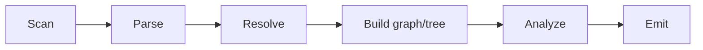

<!-- markdownlint-disable MD041 -->
# 🕸️ matlatl

[](https://github.com/stacklok/matlatl/actions/workflows/ci.yml)
[](https://pkg.go.dev/github.com/stacklok/matlatl)
[](https://goreportcard.com/report/github.com/stacklok/matlatl)
[](LICENSE)

> Map the markdown in your repo into trees and graphs, find the orphans, and emit
> artifacts that are equally readable by **humans** and **LLMs**.

`matlatl` is Nahuatl for *net*: the tool casts a net over your repo's markdown —
every link a knot, every doc a node — then shows you the holes and what slipped
through (the orphans).

It recursively reads every markdown file, parses front matter, headings, and
links (relative links, wikilinks, anchors, embeds), and builds two overlaid
structures:

- a **tree** — the folder / front-matter hierarchy plus intra-document section nesting, and
- a **graph** — the typed cross-reference relationships between documents and sections.

From those it surfaces:

- **Structure problems**, graduated rather than binary — isolated **orphans**,
  **unreachable** docs (no path from a root such as `README.md`), **under-linked**
  docs (too few inbound links to be discoverable), and **dead-ends** (nothing
  onward) — plus **broken links** and **broken anchors**.
- **Macro-shape** — a **bow-tie** classification (core / in / out / tendril /
  disconnected) and corpus **navigability metrics** (compactness, stratum,
  characteristic/median path length, clustering coefficient, diameter): how
  connected, how hierarchical, and how many clicks apart your docs are.
- **Critical paths** — the **load-bearing docs** (betweenness centrality, the
  connectors most navigation flows through) and the **single points of failure**
  (articulation points and bridges, the docs and links whose removal fragments
  the corpus).
- **Importance & navigation** — **PageRank** global importance (beside HITS),
  **reading-order trails** (a suggested path through each cluster), **backlinks**
  (what links to each doc), and **low-scent anchors** (links whose text — a
  generic "click here" — barely previews where they lead).

It then renders the result for three audiences:

- **Humans** — a colorized terminal report, a committable Markdown report, Mermaid and
  Graphviz/DOT diagrams, and a navigable `index.md` (with backlinks).
- **LLMs (reading)** — a compact, queryable `graph.json`, a `trails.json` reading
  order, an `llms.txt` family, and a `findings.json` where every finding is a
  self-contained, actionable fix instruction.
- **Acting agents** — `fix-prompt` emits a self-contained, agent-agnostic prompt
  that turns the findings into fixes: `matlatl fix-prompt . | claude -p`.

## Installation

**Prerequisites:** [Go](https://go.dev/dl/) 1.26+.

```console
$ go install github.com/stacklok/matlatl/cmd/matlatl@latest
```

Or build from source:

```console
$ git clone https://github.com/stacklok/matlatl
$ cd matlatl
$ task build            # builds ./bin/matlatl (or: go build -o bin/matlatl ./cmd/matlatl)
$ ./bin/matlatl version
```

## Quick start

```console
$ matlatl .                 # scan + analyze, print the terminal report
$ matlatl check .           # CI lint mode: non-zero exit on broken links/anchors
$ matlatl graph . --format mermaid
$ matlatl index .           # emit index.md + llms.txt
$ matlatl orphans .         # list orphans, under-linked, dead-end & unreachable docs
$ matlatl fix-prompt . | claude -p   # agent-ready prompt to fix the findings
$ matlatl serve .           # MCP server exposing graph queries to agents
```

## Example

`matlatl` run on its own repository (trimmed):

```text
Corpus: 26 documents, 216 headings, 86 references across 2 components.

Broken links (0)        none
Broken anchors (0)      none
Isolated orphans (0)    none
Unreachable (0)         none
Under-linked (4)        AGENTS.md, CHANGELOG.md, CONTRIBUTING.md, docs/user-guide.md
Dead-ends (14)          docs/adr/0001-document-identity.md, ...

Structure: 2 core, 7 in, 5 out, 10 tendril, 2 disconnected

Navigability
  Compactness: 0.214 (0 = disconnected, 1 = fully connected)
  Stratum: 0.917 (0 = cyclic/symmetric, 1 = pure hierarchy)
  Characteristic path length: 1.661 (mean clicks between linked docs)
  Diameter: 3 (longest shortest path)

Load-bearing docs (most shortest paths flow through them)
  0.037  matlatl developer guide
  0.021  11. Per-repo configuration file (.matlatl.yml)

Critical structure (single points of failure)
  Articulation points: none
  Bridges (1): single links whose removal disconnects two clusters
    docs/research/information-organization-explained.md — docs/research/information-organization-theory.md
```

## Why another markdown tool?

Link checkers (lychee, markdown-link-check) validate links but build no graph.
Knowledge tools (Obsidian, Foam, Dendron, Quartz) visualize a graph but are not
CI-oriented and emit nothing an agent can act on. `matlatl` builds the graph and
treats it as a **machine-readable, queryable first-class output**.

Broken-link and orphan checking is the way in: a `check` gate that fails a PR on
the rot a link checker would catch, plus the orphans, unreachable pages, and weak
spots in the graph that a flat link check can't see. But the real point is what
surrounds that graph. Your docs are now written and read by agents as much as by
people, so `matlatl` emits the graph (`graph.json`), a navigable `llms.txt`, and
findings an agent can fix straight from (`findings.json`, `fix-prompt`), and it
serves the whole thing over MCP. One graph, rendered for whoever needs it: a
human, an LLM reading, or an agent acting.

So, what happens when an agent has been scribbling in your repo? `matlatl` knows
the difference between your docs and an agent's scaffolding. A `SKILL.md` is an
entry point, not an orphan; agent worktrees and scratch plans are ignored by
default; and a `.matlatl.yml` lets a repo declare its own roots (say, your
sub-agent definitions) so the health check stays accurate instead of burying you
in false orphans.

## Use cases

- **Gate doc rot in CI.** `matlatl check . --strict` fails a PR on broken links
  and anchors — the job a link checker does — but also catches orphans,
  unreachable pages, and structural weak spots a flat check can't see. (matlatl
  gates its own CI this way.) In GitHub Actions, the repo's
  [composite action](docs/user-guide.md#github-action) runs the gate in one step,
  with annotations and a job summary.
- **Fix the docs with an agent.** `matlatl fix-prompt . | claude -p` pipes the
  findings into any coding agent as a self-contained, injection-hardened fix
  prompt.
- **Make a repo legible to AI agents.** Emit `llms.txt` + `graph.json` so an
  agent landing in your repo gets an importance-ordered map *and* an honest
  statement of what's missing, instead of crawling blind.
- **Query the doc graph live over MCP.** Point an agent at `matlatl serve` and let
  it ask `what-links-to`, `path-between`, `list-orphans`, `critical-docs`, and
  more — without re-parsing markdown itself.
- **Audit a large or inherited knowledge base.** Run the navigability, bow-tie,
  and critical-path analysis to find single points of failure, hard-to-discover
  pages, and disconnected clusters that should be bridged.

## How it works

A six-stage pipeline turns a repository's markdown into the analysis every
emitter renders from:



See [`docs/architecture.md`](docs/architecture.md) for the pipeline, the
three-layer design, and the core model types.

```mermaid
flowchart LR
  n_78a740c6ccf6937a["Agent guide — AGENTS.md"]
  class n_78a740c6ccf6937a c0
  n_7b163b263d162ee4["Changelog — CHANGELOG.md"]
  class n_7b163b263d162ee4 c0
  n_02c89c4e53dbd698["Contributing to matlatl — CONTRIBUTING.md"]
  class n_02c89c4e53dbd698 c0
  n_3f15cf6f633a5d62["🕸️ matlatl — README.md"]
  class n_3f15cf6f633a5d62 c0
  n_4a4c35818cace850["1. Document identity is the canonical repository-relative path — docs/adr/0001-document-identity.md"]
  class n_4a4c35818cace850 c0
  n_c22bbb837afe10c7["2. Library choices — docs/adr/0002-library-choices.md"]
  class n_c22bbb837afe10c7 c0
  n_aea8450bc599d408["3. Security model for untrusted repositories — docs/adr/0003-security-model.md"]
  class n_aea8450bc599d408 c0
  n_f0bae63316793c48["4. DDD layering and full-fat v1 scope — docs/adr/0004-ddd-layering-and-scope.md"]
  class n_f0bae63316793c48 c0
  n_efe6080ee7462139["5. check exit-code contract — docs/adr/0005-exit-code-contract.md"]
  class n_efe6080ee7462139 c0
  n_a9317998cb57b1fd["6. Canonical anchor-slug dialect — docs/adr/0006-slug-dialect.md"]
  class n_a9317998cb57b1fd c0
  n_0f10a54030ee6eb3["7. Graph node semantics and the document projection — docs/adr/0007-graph-node-semantics.md"]
  class n_0f10a54030ee6eb3 c0
  n_00e99f8eafe30d16["8. Directory links resolve and confer navigational reachability — docs/adr/0008-directory-links.md"]
  class n_00e99f8eafe30d16 c0
  n_49c521dc19969d84["9. fix-prompt serves acting agents with an embedded, agent-agnostic prompt — docs/adr/0009-fix-prompt-acting-agents.md"]
  class n_49c521dc19969d84 c0
  n_c91fce8c74e9c0d8["10. How matlatl treats agent-tooling scaffolding — docs/adr/0010-agent-scaffolding-roots-and-default-ignores.md"]
  class n_c91fce8c74e9c0d8 c0
  n_13bff28232f9947d["11. Per-repo configuration file ❨.matlatl.yml❩ — docs/adr/0011-per-repo-config-file.md"]
  class n_13bff28232f9947d c0
  n_4c36157c981d8b48["12. Graduated structure findings and bow-tie classification — docs/adr/0012-graduated-structure-and-bowtie.md"]
  class n_4c36157c981d8b48 c0
  n_c943857489743a19["13. Topology-based link prediction ❨suggested links❩ — docs/adr/0013-topology-link-prediction.md"]
  class n_c943857489743a19 c0
  n_048497f143fc3209["14. Corpus navigability metrics — docs/adr/0014-navigability-metrics.md"]
  class n_048497f143fc3209 c0
  n_54e2e1b31eccc87d["15. Critical-path analysis: betweenness centrality + articulation points and bridges — docs/adr/0015-critical-path-analysis.md"]
  class n_54e2e1b31eccc87d c0
  n_a83bc583ad99ad8a["Architecture Decision Records — docs/adr/README.md"]
  class n_a83bc583ad99ad8a c0
  n_8bf427124d6c1eff["matlatl architecture — docs/architecture.md"]
  class n_8bf427124d6c1eff c0
  n_a3c19499b57c391a["matlatl developer guide — docs/dev-guide.md"]
  class n_a3c19499b57c391a c0
  n_6ad6931b26f1e005["Navigability ideas for matlatl, in plain terms — docs/research/information-organization-explained.md"]
  class n_6ad6931b26f1e005 c1
  n_060b885640cd8a80["Hyperlink theory & information organization — a design-research map for matlatl — docs/research/information-organization-theory.md"]
  class n_060b885640cd8a80 c1
  n_364378b8d4bd7631[".matlatl.yml — per-repo configuration ❨schema v1❩ — docs/schemas/matlatl-config-v1.md"]
  class n_364378b8d4bd7631 c0
  n_f93d26fbe4bd69fc["matlatl user guide — docs/user-guide.md"]
  class n_f93d26fbe4bd69fc c0
  n_78a740c6ccf6937a --> n_a83bc583ad99ad8a
  n_78a740c6ccf6937a --> n_8bf427124d6c1eff
  n_78a740c6ccf6937a --> n_a3c19499b57c391a
  n_78a740c6ccf6937a --> n_f93d26fbe4bd69fc
  n_7b163b263d162ee4 --> n_49c521dc19969d84
  n_7b163b263d162ee4 --> n_c91fce8c74e9c0d8
  n_7b163b263d162ee4 --> n_13bff28232f9947d
  n_7b163b263d162ee4 --> n_4c36157c981d8b48
  n_7b163b263d162ee4 --> n_c943857489743a19
  n_7b163b263d162ee4 --> n_048497f143fc3209
  n_7b163b263d162ee4 --> n_54e2e1b31eccc87d
  n_7b163b263d162ee4 --> n_364378b8d4bd7631
  n_02c89c4e53dbd698 --> n_a83bc583ad99ad8a
  n_02c89c4e53dbd698 --> n_a3c19499b57c391a
  n_3f15cf6f633a5d62 --> n_78a740c6ccf6937a
  n_3f15cf6f633a5d62 --> n_7b163b263d162ee4
  n_3f15cf6f633a5d62 --> n_02c89c4e53dbd698
  n_3f15cf6f633a5d62 --> n_4a4c35818cace850
  n_3f15cf6f633a5d62 --> n_c22bbb837afe10c7
  n_3f15cf6f633a5d62 --> n_aea8450bc599d408
  n_3f15cf6f633a5d62 --> n_f0bae63316793c48
  n_3f15cf6f633a5d62 --> n_efe6080ee7462139
  n_3f15cf6f633a5d62 --> n_a9317998cb57b1fd
  n_3f15cf6f633a5d62 --> n_0f10a54030ee6eb3
  n_3f15cf6f633a5d62 --> n_00e99f8eafe30d16
  n_3f15cf6f633a5d62 --> n_49c521dc19969d84
  n_3f15cf6f633a5d62 --> n_c91fce8c74e9c0d8
  n_3f15cf6f633a5d62 --> n_13bff28232f9947d
  n_3f15cf6f633a5d62 --> n_4c36157c981d8b48
  n_3f15cf6f633a5d62 --> n_c943857489743a19
  n_3f15cf6f633a5d62 --> n_048497f143fc3209
  n_3f15cf6f633a5d62 --> n_54e2e1b31eccc87d
  n_3f15cf6f633a5d62 --> n_a83bc583ad99ad8a
  n_3f15cf6f633a5d62 --> n_8bf427124d6c1eff
  n_3f15cf6f633a5d62 --> n_a3c19499b57c391a
  n_3f15cf6f633a5d62 --> n_f93d26fbe4bd69fc
  n_13bff28232f9947d --> n_aea8450bc599d408
  n_13bff28232f9947d --> n_f0bae63316793c48
  n_13bff28232f9947d --> n_efe6080ee7462139
  n_13bff28232f9947d --> n_0f10a54030ee6eb3
  n_13bff28232f9947d --> n_c91fce8c74e9c0d8
  n_13bff28232f9947d --> n_364378b8d4bd7631
  n_8bf427124d6c1eff --> n_4a4c35818cace850
  n_8bf427124d6c1eff --> n_c22bbb837afe10c7
  n_8bf427124d6c1eff --> n_aea8450bc599d408
  n_8bf427124d6c1eff --> n_f0bae63316793c48
  n_8bf427124d6c1eff --> n_efe6080ee7462139
  n_8bf427124d6c1eff --> n_a9317998cb57b1fd
  n_8bf427124d6c1eff --> n_0f10a54030ee6eb3
  n_8bf427124d6c1eff --> n_00e99f8eafe30d16
  n_8bf427124d6c1eff --> n_49c521dc19969d84
  n_8bf427124d6c1eff --> n_c91fce8c74e9c0d8
  n_8bf427124d6c1eff --> n_13bff28232f9947d
  n_8bf427124d6c1eff --> n_4c36157c981d8b48
  n_8bf427124d6c1eff --> n_c943857489743a19
  n_8bf427124d6c1eff --> n_048497f143fc3209
  n_8bf427124d6c1eff --> n_54e2e1b31eccc87d
  n_8bf427124d6c1eff --> n_a83bc583ad99ad8a
  n_a3c19499b57c391a --> n_4a4c35818cace850
  n_a3c19499b57c391a --> n_c22bbb837afe10c7
  n_a3c19499b57c391a --> n_aea8450bc599d408
  n_a3c19499b57c391a --> n_f0bae63316793c48
  n_a3c19499b57c391a --> n_efe6080ee7462139
  n_a3c19499b57c391a --> n_a9317998cb57b1fd
  n_a3c19499b57c391a --> n_0f10a54030ee6eb3
  n_a3c19499b57c391a --> n_00e99f8eafe30d16
  n_a3c19499b57c391a --> n_49c521dc19969d84
  n_a3c19499b57c391a --> n_c91fce8c74e9c0d8
  n_a3c19499b57c391a --> n_13bff28232f9947d
  n_a3c19499b57c391a --> n_4c36157c981d8b48
  n_a3c19499b57c391a --> n_c943857489743a19
  n_a3c19499b57c391a --> n_048497f143fc3209
  n_a3c19499b57c391a --> n_54e2e1b31eccc87d
  n_a3c19499b57c391a --> n_a83bc583ad99ad8a
  n_a3c19499b57c391a --> n_8bf427124d6c1eff
  n_6ad6931b26f1e005 --> n_060b885640cd8a80
  n_364378b8d4bd7631 --> n_13bff28232f9947d
  n_f93d26fbe4bd69fc --> n_4a4c35818cace850
  n_f93d26fbe4bd69fc --> n_c22bbb837afe10c7
  n_f93d26fbe4bd69fc --> n_aea8450bc599d408
  n_f93d26fbe4bd69fc --> n_f0bae63316793c48
  n_f93d26fbe4bd69fc --> n_efe6080ee7462139
  n_f93d26fbe4bd69fc --> n_a9317998cb57b1fd
  n_f93d26fbe4bd69fc --> n_0f10a54030ee6eb3
  n_f93d26fbe4bd69fc --> n_00e99f8eafe30d16
  n_f93d26fbe4bd69fc --> n_49c521dc19969d84
  n_f93d26fbe4bd69fc --> n_c91fce8c74e9c0d8
  n_f93d26fbe4bd69fc --> n_13bff28232f9947d
  n_f93d26fbe4bd69fc --> n_4c36157c981d8b48
  n_f93d26fbe4bd69fc --> n_c943857489743a19
  n_f93d26fbe4bd69fc --> n_048497f143fc3209
  n_f93d26fbe4bd69fc --> n_54e2e1b31eccc87d
  n_f93d26fbe4bd69fc --> n_a83bc583ad99ad8a
  n_f93d26fbe4bd69fc --> n_8bf427124d6c1eff
  n_f93d26fbe4bd69fc --> n_a3c19499b57c391a
  n_f93d26fbe4bd69fc --> n_364378b8d4bd7631
  classDef c0 fill:#e3f2fd,stroke:#90a4ae,color:#000;
  classDef c1 fill:#f1f8e9,stroke:#90a4ae,color:#000;
  classDef orphan fill:#ffebee,stroke:#c62828,stroke-width:2px,color:#000;
  classDef unreachable fill:#fff8e1,stroke:#ff8f00,stroke-width:2px,color:#000;
  classDef broken fill:#ffcdd2,stroke:#b71c1c,stroke-width:2px,color:#000;
```

<details>
<summary><strong>The reference graph matlatl emits for its own docs</strong> (real <code>matlatl graph . --format mermaid</code> output) — two components, the README as the giant hub, and the research pair connected by a single bridge</summary>



</details>

## Status

✅ The P0–P6 foundation is feature-complete: secure scan + parse, link/anchor
resolution, the reference graph (reachability, components, HITS hub/authority),
human emitters (terminal, Markdown, Mermaid, DOT, index), LLM emitters
(`graph.json`, the `llms.txt` family, actionable `findings.json`), fan-out
parsing, and a read-only MCP server. Phases **P7–P10** extend the analysis with
the **graduated structure ladder + bow-tie** classification
([ADR 0012](docs/adr/0012-graduated-structure-and-bowtie.md)), **topology-based
link prediction** ([ADR 0013](docs/adr/0013-topology-link-prediction.md)),
corpus-level **navigability metrics**
([ADR 0014](docs/adr/0014-navigability-metrics.md)), **critical-path
analysis** — betweenness + articulation points / bridges
([ADR 0015](docs/adr/0015-critical-path-analysis.md)), and the
**agent-experience** analyses — PageRank, reading-order trails, backlinks, and
information scent ([ADR 0016](docs/adr/0016-agent-experience.md)) — surfaced over
the same report, `graph.json`, `trails.json`, `llms.txt`, and MCP. See
[`docs/architecture.md`](docs/architecture.md) and the [ADRs](docs/adr/).

## Documentation

- [User guide](docs/user-guide.md) — commands, flags, CI usage, the LLM artifacts
- [Developer guide](docs/dev-guide.md) — layout, rules, testing, how to contribute
- [Architecture](docs/architecture.md)
- [Architecture Decision Records](docs/adr/)
- [graph.json schema](docs/schemas/graph.schema.json) · [findings.json schema](docs/schemas/findings.schema.json) · [trails.json schema](docs/schemas/trails.schema.json)
- [Contributing](CONTRIBUTING.md) · [Changelog](CHANGELOG.md) · [Agent guide](AGENTS.md)

## Contributing

Contributions are welcome. See the [contributing guidelines](CONTRIBUTING.md) for
the layout, the enforced rules (domain purity, determinism, security), and how to
run the tests, and the [developer guide](docs/dev-guide.md) for a deeper tour.

## License

Apache-2.0 © 2026 Stacklok, Inc. See [`LICENSE`](LICENSE).

`SPDX-License-Identifier: Apache-2.0`
